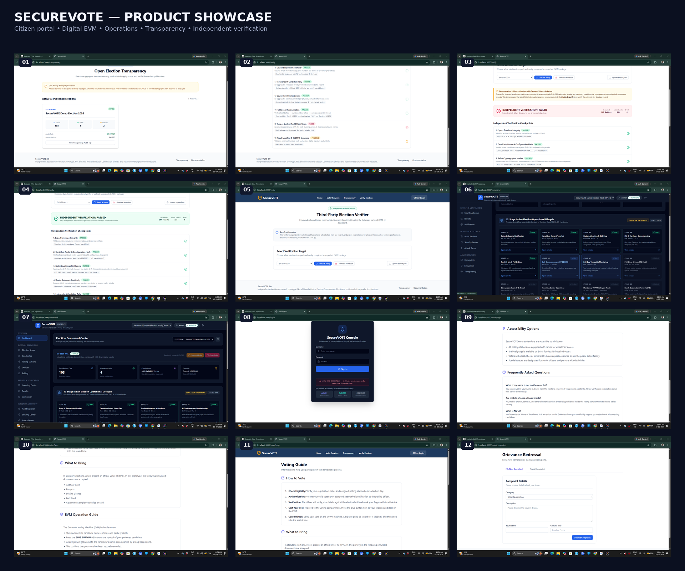
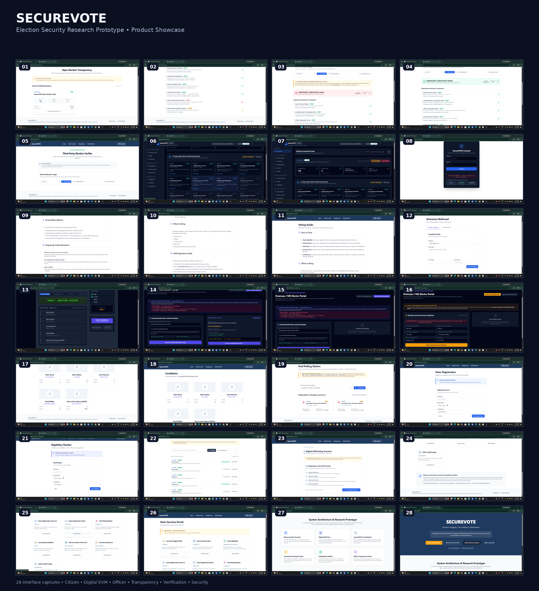

# SecureVOTE

**Election Security Research Prototype — Embedded EVM + FastAPI + Next.js + Independent Verification**

SecureVOTE is an educational and academic security research prototype that explores how an electronic voting ecosystem can combine **embedded-device controls, authenticated device workflows, tamper-evident audit trails, cryptographic result signing, reconciliation, adversarial testing, and independent verification**.

> [!IMPORTANT]
> **Research / non-affiliation notice:** SecureVOTE is an independent educational and academic prototype. It is **not affiliated with, endorsed by, certified by, or operated by the Election Commission of India (ECI), BEL, ECIL, any State Election Commission, or any government authority.** It is not intended for legally binding elections.


## Live deployment

| Surface | Deployment |
|---|---|
| Public SecureVOTE dashboard | https://secure-vote-eta.vercel.app/ |
| Backend API health | https://securevote-production-1a7f.up.railway.app/api/health |
| API explorer | https://securevote-production-1a7f.up.railway.app/docs |

The current deployment connects the Next.js dashboard on **Vercel** to the FastAPI backend and PostgreSQL service on **Railway**. The browser-based Digital EVM has been smoke-tested against the live deployment using synthetic test data.

## Product showcase



**End-to-end SecureVOTE ecosystem:** voter services, Digital EVM, transparency, independent verification, officer operations, security workflows, and election simulation.



## Product at a glance

SecureVOTE is deliberately larger than a dashboard:

- **Citizen / Voter Portal** — simulated eligibility, voter services, polling information, candidate information and grievance flows.
- **Digital EVM Twin** — browser-based simulation of an EVM-style voting workflow with candidate selection, confirmation and VVPAT-style preview.
- **Physical EVM / Firmware** — Arduino Uno / ATmega328P firmware with an explicit 12-state finite-state machine, EEPROM state and physical tamper handling.
- **Election Operations Console** — election lifecycle, device operations, reconciliation, audit and security workflows.
- **Transparency Center** — aggregate election information and verification evidence without exposing raw credentials.
- **Independent Verifier** — database-independent verification of exported election records.
- **Security / Attack Lab** — deterministic adversarial scenarios for replay, tampering, configuration changes, tally manipulation and concurrency.

## Architecture

```text
 Physical EVM / Digital EVM Twin
              │
              â–¼
        Device / API Layer
              │
              â–¼
       Election Backend
   FastAPI + PostgreSQL/SQLite
              │
       ┌──────┴───────┐
       â–¼              â–¼
   Audit Chain     Ballots / State
       │              │
       └──────┬───────┘
              â–¼
       Reconciliation
              │
              â–¼
       Result Manifest
              │
        Ed25519 Signature
              │
              â–¼
     Independent Verifier
              │
       PASS / FAIL proofs
```

**Design principle:** Device ≠ Backend ≠ Verifier ≠ Dashboard.

The verifier is intentionally decoupled from FastAPI and SQLAlchemy so that exported election data can be checked independently.

## Security mechanisms explored

| Area | Prototype mechanism |
|---|---|
| Device state | Deterministic 12-state firmware FSM |
| Physical tamper | EEPROM-persistent tamper latch |
| Replay resistance | Monotonic device sequence numbers |
| Device authorization | Registered / revoked device checks |
| Auditability | SHA-256 hash-chained audit events |
| Result integrity | Canonical result manifest + Ed25519 signature |
| Reconciliation | Candidate totals = ballot total = device totals |
| Identity abstraction | HMAC-SHA256 keyed token handling |
| Independent verification | Offline JSON export verifier |
| Anomaly detection | Deterministic advisory rules |
| External anchoring | Local anchor abstraction; external ledger adapter is optional |

### Security boundary that matters

SecureVOTE intentionally does **not** claim that a hash chain, RFID, encryption, blockchain, or tamper logging alone makes an election secure.

In particular:

- RFID authentication is **not** voter eligibility.
- Tamper detection is **not** tamper prevention.
- A hash chain is **tamper-evident**, not magically immutable.
- A digital signature proves integrity/authorship of the signed manifest; it does not prove that the underlying election process was honest.
- The current research schema retains session-to-ballot linkage for tracing and testing, so **mathematical ballot anonymity is not claimed**.
- UART is plaintext in the current prototype.
- External public blockchain anchoring is **not configured** by default.

## Independent verification

One of the central demonstrations is:

```text
Export election archive
        │
        â–¼
Independent verifier
        │
        ├── configuration
        ├── ballot hashes
        ├── ballot sequence
        ├── candidate totals
        ├── device totals
        ├── reconciliation
        ├── audit chain
        ├── audit root
        ├── manifest
        ├── Ed25519 signature
        └── anchor receipt
                │
          ┌─────┴─────┐
          â–¼           â–¼
        PASS         FAIL
```

A controlled mutation can intentionally change exported data and demonstrate that independent verification detects the resulting integrity failure.

## Validation snapshot

Latest project validation checkpoint:

| Component | Result |
|---|---:|
| Backend test suite | **88 / 88 passed** |
| Firmware native tests | **17 / 17 passed** |
| Dashboard tests | **28 / 28 passed** |
| Next.js production build | **43 / 43 routes compiled** |
| Standalone verifier tests | **12 / 12 passed** |
| Attack suite | **12 / 12 passed** |
| Deterministic 1,000-ballot demonstration | **Validated** |
| Docker / Wokwi automation | **Environment-blocked, documented** |

The repository contains reproducibility and security documentation for the detailed test methodology.

## Repository structure

```text
secureVOTE/
├── backend/                 # FastAPI, SQLAlchemy, election/security services
├── dashboard/               # Next.js / TypeScript civic + operations UI
├── firmware/                # Arduino / PlatformIO EVM firmware + serial bridge
├── docs/                    # Architecture, threat model, privacy, verification
├── screenshots/              # Product showcase assets
└── README.md
```

## Run locally

### Backend

```powershell
cd backend
python -m venv venv
.\venv\Scripts\activate
pip install -r requirements.txt
uvicorn app.main:app --reload --port 8000
```

### Dashboard

```powershell
cd dashboard
npm install
npm run dev
```

Open `http://localhost:3000`.

### Firmware

```powershell
cd firmware
pio run -e uno
pio test -e native
```

### Standalone verifier

```powershell
python backend/standalone_verifier/verifier.py election_export.json
```

## Research directions

SecureVOTE is intended as a platform for further study rather than a claim of production readiness.

Potential research directions include:

- cryptographic mixnets and stronger ballot-secrecy constructions;
- homomorphic tallying and end-to-end verifiability;
- hardware-backed key storage;
- formally verified embedded components;
- optical / air-gapped result transfer;
- stronger device attestation;
- measurable fault-injection and side-channel experiments;
- independent reproducibility studies.

## Current limitations

1. The Arduino UART channel is plaintext.
2. The prototype database can retain a session-to-ballot relationship for research tracing.
3. Voter eligibility is simulated and is not connected to a statutory electoral roll.
4. The Digital EVM is a simulator / digital twin, not a certified election machine.
5. No certified VVPAT implementation is claimed.
6. External blockchain anchoring is not configured.
7. Docker and Wokwi automated execution depend on the local environment.

## Release

**Current portfolio baseline: v2.0.0**

The v2.0.0 tag represents the locked election-security research prototype baseline. The current main branch contains post-baseline deployment hardening for the public Vercel + Railway demonstration.

