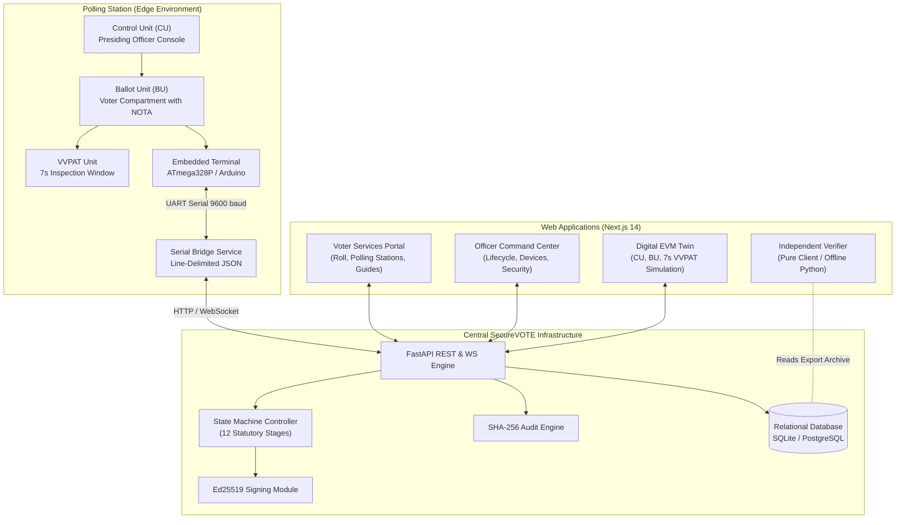

# SecureVOTE System Architecture

## 1. Architectural Overview

SecureVOTE is architected as a decoupled, multi-tier system modeling the operational realities of Indian elections while incorporating modern verifiable computing mechanisms.

---

## 2. Component Topology

### 1. Embedded Hardware Terminal (`firmware/`)
- **Microcontroller**: ATmega328P (Arduino Uno form factor).
- **Peripherals**: Pushbutton matrix (candidates + NOTA), LCD 16x2 / 20x4 display, status LEDs (Ready, Cast, Tamper), and microswitch enclosure tamper sensor on pin D8.
- **EEPROM Storage**: Non-volatile storage of device ID, monotonic packet sequence counter, candidate count, and tamper latch flag (`0x0E`).
- **Communication**: UART serial link at 9600 baud using line-delimited JSON messages.

### 2. Host Serial Bridge (`backend/app/serial_bridge.py`)
- Bridges physical microcontrollers or Wokwi simulator sockets to the central backend.
- Enforces packet framing, sequence validation, and translation to `/api/votes` payload submissions.

### 3. Core Backend Engine (`backend/app/`)
- **Framework**: FastAPI (Python 3.11+) with asynchronous execution.
- **ORM / Persistence**: SQLAlchemy async engine supporting SQLite (local test) and PostgreSQL (production).
- **Authentication**: JWT-based Role-Based Access Control (`ADMIN`, `AUDITOR`, `OBSERVER`).
- **Cryptographic Engine**:
  - SHA-256 for candidate configuration freezing and ballot hashing.
  - Continuous SHA-256 hash chaining for all audit log events.
  - Ed25519 asymmetric elliptic curve signatures for certified result manifests.
  - Keyed HMAC-SHA256 pseudonymization for RFID credentials.

### 4. Officer Command & Public Dashboard (`dashboard/`)
- **Framework**: Next.js 14 (App Router) + TypeScript + Tailwind CSS.
- **Watermark & Notice**: Persistent `SIMULATION PROTOTYPE • NOT ECI` watermark.
- **Portals**:
  - Public Voter Portal (Services, Simulated Electoral Roll, Polling Station Finder, Rule 49N Accessibility Info).
  - Digital EVM Twin (Control Unit, Ballot Unit, 7-second VVPAT Slip, 1000Hz confirmation tone).
  - Officer Command Center (12-Stage Operational Lifecycle, Device Fleet Monitor, Anomaly Center).
  - Independent Machine Verifier (Client-side 9-checkpoint mathematical verification).

### 5. Standalone Offline Verifier (`backend/standalone_verifier/verifier.py`)
- Independent pure Python script with zero database or framework dependencies.
- Audits exported JSON archives against 12 strict mathematical invariants.

---

## 3. Communication Protocols

1. **Terminal Serial Protocol**: Line-delimited JSON frames over UART (e.g. `{"type":"VOTE","device_id":"EVM-001","seq":1,"candidate_id":"C001"}`).
2. **REST API**: JSON over HTTP/HTTPS with standard response status codes (`200 OK`, `201 Created`, `400 Bad Request`, `403 Forbidden`, `409 Conflict`).
3. **Real-Time Telemetry**: WebSockets (`/ws/telemetry`) streaming live terminal status and advisory anomaly alerts to officer dashboards.

---

## 4. Architectural Boundaries

- **Boundary 1 (UART Wire Plaintext)**: Microcontrollers lack hardware TLS; transport relies on serial frame validation and monotonic sequences.
- **Boundary 2 (Relational Traceability)**: Session-to-ballot linkage is preserved in the database for educational traceability; true secret-ballot anonymity requires cryptographic mixnets.
- **Boundary 3 (Air-Gap Demarcation)**: The actual Indian ECI election system utilizes air-gapped physical hardware with OTP microcontrollers; SecureVOTE is an online software simulation designed for cryptographic auditability research.
