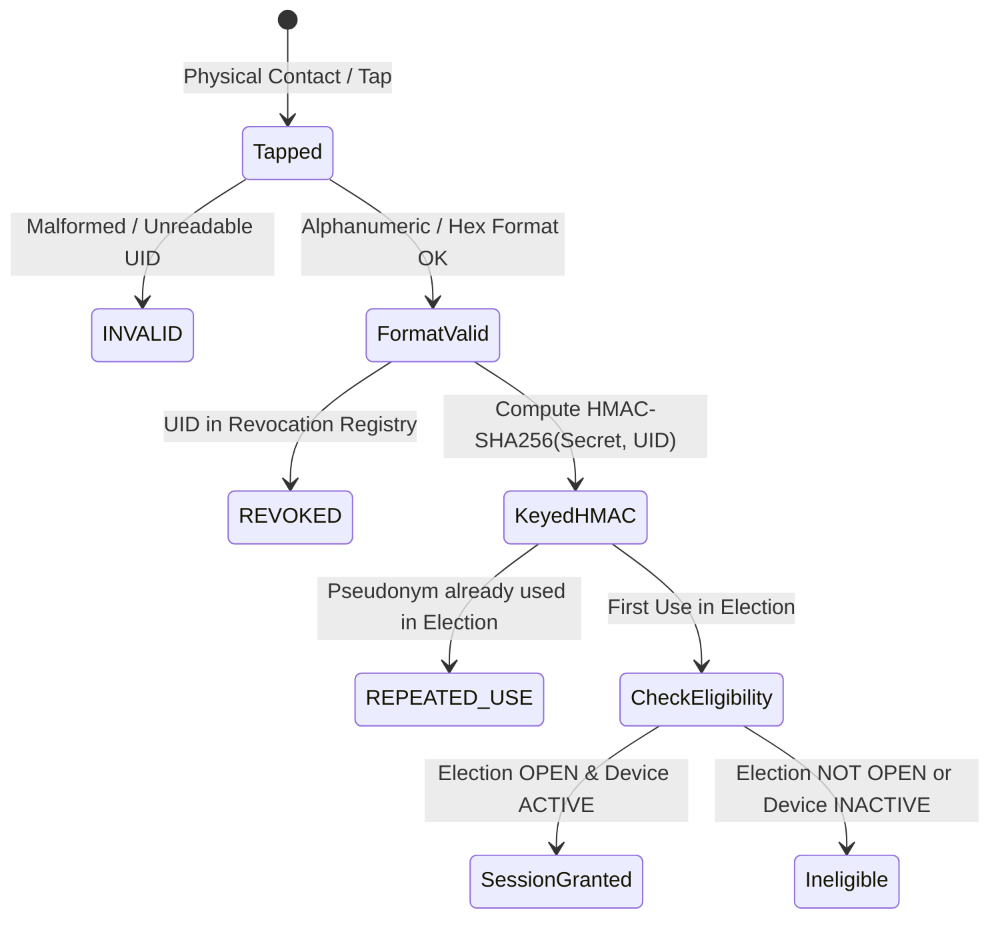

# SecureVOTE  -  RFID & Identity Abstraction Specification

## 1. Overview & Architectural Principles

SecureVOTE provides an identity abstraction layer that decouples physical identity tokens (e.g. RFID/NFC smartcards) from the voting system core. This abstraction serves two essential security objectives:
1. **Zero-Knowledge Physical UID Privacy**: Raw card serial numbers or hardware chip UIDs are never stored in databases, never transmitted over audit streams, and never written to persistent logs.
2. **Strict Architectural Separation**:
   $$\text{RFID AUTHENTICATION} \neq \text{VOTER ELIGIBILITY}$$
   Physical possession of an authentic smartcard proves only that the card is genuine and unrevoked. It **does not** confer a legal right to cast a ballot unless election lifecycle and voter eligibility constraints are met.

---

## 2. Keyed Pseudonymization (Mandatory Amendment 3)

### 2.1 The Vulnerability of Bare SHA-256
In many naïve electronic voting designs, voter card IDs are hashed using a plain cryptographic hash function:
$$\text{pseudonym}_{\text{insecure}} = \text{SHA-256}(\text{raw\_uid})$$

Because physical RFID card UIDs typically comprise only 4 to 7 bytes (e.g. MIFARE Classic 4-byte UIDs or MIFARE Ultralight 7-byte UIDs), the entire keyspace is tiny:
$$2^{32} \approx 4.29 \times 10^9 \text{ combinations}$$

An adversary with a precomputed rainbow table or an inexpensive GPU cluster can invert bare SHA-256 hashes back to physical card numbers in seconds, permanently destroying ballot secrecy and enabling unauthorized voter tracking across precincts.

### 2.2 Enforced Keyed Pseudonymization
SecureVOTE strictly mandates keyed HMAC-SHA256 pseudonymization:
$$\text{pseudonym} = \text{HMAC-SHA-256}(K_{\text{server}}, \text{raw\_uid})$$

where $K_{\text{server}}$ is a server-side secret loaded via the environment variable `SECUREVOTE_RFID_SECRET` (or a secure secrets manager / mounted secret volume in production).

#### Secret Provisioning & Fail-Safe Runtime Behavior:
- **Zero Hardcoded Secrets**: Production source code contains **no default or fallback secrets**.
- **Mandatory Environment Configuration**: The server requires `SECUREVOTE_RFID_SECRET` to be explicitly provisioned in the environment.
- **Fail-Safe Operation**: If `SECUREVOTE_RFID_SECRET` is missing or unconfigured at runtime, the pseudonymization subsystem fails safely and explicitly (raising `RuntimeError` and returning HTTP 500 configuration error). It **never** silently falls back to a default, insecure, or hardcoded secret.
- **Test Isolation**: Automated tests execute using ephemeral, deterministic test fixtures injected via `pytest` fixtures, completely independent of production secret storage.

#### Cryptographic Properties:
1. **Non-Invertibility**: Without $K_{\text{server}}$, an attacker cannot precompute rainbow tables or dictionary attacks.
2. **Domain Separation**: Different elections or jurisdictions using different secrets produce unlinkable pseudonyms for the exact same physical card:
   $$\text{HMAC}(K_A, \text{UID}) \neq \text{HMAC}(K_B, \text{UID})$$
3. **Deterministic Local Matching**: Within a single election deployment, the same card consistently maps to the same pseudonym, enabling robust duplicate-use detection.

---

## 3. Physical State Machine & Card Lifecycle

The `MockRFIDReader` simulates four deterministic card states:



### Card Status Descriptions:
- **`VALID`**: Card format is valid, unrevoked, and unused. If the election is `OPEN`, a voting session is created; if the election is not open, authentication succeeds but no session is authorized.
- **`INVALID`**: Unreadable, corrupted, or non-compliant chip format. Rejected prior to pseudonymization.
- **`REVOKED`**: Card is registered on the revocation list (e.g. reported lost or stolen). Rejected at the authentication layer.
- **`REPEATED_USE`**: Card was already used to authorize a ballot in the current election. Rejected to prevent double voting.

---

## 4. Architectural Boundary Enforcement

```
+-------------------------------------------------------------------+
|                     PHYSICAL / AUTHENTICATION LAYER               |
|                                                                   |
|   +---------------+      +-------------------+                    |
|   | RFID Chip Tap | ---> | Keyed HMAC-SHA256 |                    |
|   +---------------+      +-------------------+                    |
|                                    |                              |
|                           [Valid Pseudonym]                       |
+------------------------------------|------------------------------+
                                     |
                                     v
+-------------------------------------------------------------------+
|               ELECTION GOVERNANCE & ELIGIBILITY LAYER             |
|                                                                   |
|   - Is the Election state == OPEN?                                |
|   - Is the target device == ACTIVE?                               |
|   - Has this credential already voted?                            |
|   - Is voter credential on the authorized registration roll?      |
|                                                                   |
|           NO                              YES                     |
|           |                                |                      |
|           v                                v                      |
|   [Session Rejected]            [VotingSession Granted]           |
|   "RFID AUTHENTICATION !=        Token: eyJhbGci...               |
|    VOTER ELIGIBILITY"                                             |
+-------------------------------------------------------------------+
```

---

## 5. API Reference

### 5.1 POST `/api/rfid/tap`
Simulates a physical RFID smartcard tap against an authenticated voting station.

#### Request Body:
```json
{
  "raw_uid": "04A1B2C3D4E5",
  "device_id": "EVM-001",
  "election_id": "EV-2026-001"
}
```

#### Response Body:
```json
{
  "authenticated": true,
  "pseudonym": "6b86b273ff34fce19d6b804eff5a3f5747ada4eaa22f1d49c01e52ddb7875b4b",
  "card_status": "VALID",
  "device_id": "EVM-001",
  "session_id": "st-8a7f1c9e2b3d4f5a",
  "notice": "RFID AUTHENTICATION != VOTER ELIGIBILITY: Authenticated and session granted for OPEN election."
}
```

### 5.2 GET `/api/rfid/demo-cards`
Retrieves preconfigured simulation profiles for UI testing without exposing raw secrets.

---

## 6. Verification & Automated Testing

The implementation is verified in `backend/tests/test_rfid.py`:
- `test_rfid_valid_tap_creates_session_in_open_election`: Valid tap yields valid session.
- `test_rfid_repeated_use_rejected`: Detects double-tap attempts.
- `test_rfid_revoked_card_rejected`: Blocks compromised credentials.
- `test_rfid_invalid_format_rejected`: Validates chip data sanitization.
- `test_mandatory_amendment_keyed_pseudonymization_not_bare_sha256`: Proves $\text{pseudonym} \neq \text{SHA-256}(\text{raw\_uid})$ and key-dependence.
- `test_rfid_missing_secret_fails_safely`: Proves missing runtime secret fails safely (raises `RuntimeError` and returns HTTP 500 configuration error, never falling back to hardcoded secrets).
- `test_rfid_explicit_secret_and_hmac_properties`: Proves explicit secret injection, determinism, and domain separation.
- `test_strict_privacy_raw_uid_never_stored_in_database`: Database-wide zero-knowledge audit.
- `test_rfid_architectural_boundary_closed_election`: Proves credential authenticity cannot bypass election lifecycle rules.
